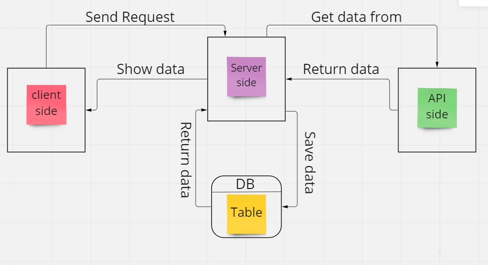

# Movies-Library --v 1

**Author Name**:Yousef AL farwan

## WRRC

## Overview

This app  will able you to check the latest movies bsed on categories

## Getting Started

<!-- What are the steps that a user must take in order to build this app on their own machine and get it running? -->.

- first step :
you should git clonned into your local machine
- second step :
enter to root dir and run 'npm install'
- third step :node server.js

## Project Features
<!-- What are the features included in you app -->
- you can open your favorit cato
- you will get the latest movies based on your spicification
- you can search for a movie
- you can search for a provider names and ids
- you can search for a genrs
- you can add your info to the database
- you can get the info from the database
